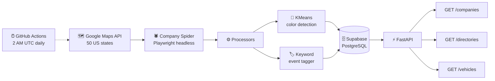
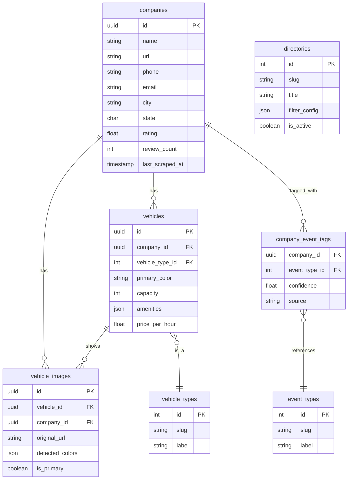

# 🚗 Limo & Party Bus Directory Scraper

> An automated data pipeline that scrapes, enriches, and categorizes every limo and party bus company in the USA — powering niche directories like *Red Limos*, *Wedding Party Buses*, or *Prom Limos*.


---

## 📌 What It Does

This system automatically:

1. **Discovers** limo & party bus companies across all 50 US states
2. **Scrapes** structured data: phone, email, description, vehicle specs, photos, amenities
3. **Detects** vehicle colors from images using ML (red, white, black, silver…)
4. **Tags** by event type (wedding, prom, birthday, corporate, airport)
5. **Stores** everything in Supabase (PostgreSQL)
6. **Exposes** a REST API to power any number of niche directories

---

## 🏗 Architecture



---

## 🗄 Database Schema



---

## 📡 API Response Example

```json
GET /directories/red-limos?state=TX

{
  "directory": {
    "slug": "red-limos",
    "title": "Red Limousines in the USA"
  },
  "count": 47,
  "companies": [
    {
      "name": "Star Limo Dallas",
      "phone": "+1-214-555-0100",
      "city": "Dallas",
      "state": "TX",
      "rating": 4.8,
      "vehicle_colors": ["red", "black"],
      "vehicle_type_slugs": ["stretch_limo", "hummer_limo"],
      "event_type_slugs": ["prom", "birthday", "bachelorette"],
      "vehicle_count": 6,
      "image_count": 18
    }
  ]
}
```

---

## 🗂 Project Structure

```
limo-directory-scraper/
├── scraper/
│   ├── spiders/
│   │   ├── google_maps_spider.py     # Finds companies via Google Maps API
│   │   └── company_spider.py         # Scrapes individual company websites
│   ├── processors/
│   │   ├── color_detector.py         # ML-based vehicle color detection
│   │   └── event_tagger.py           # Tags companies by event type
│   └── utils/
│       ├── supabase_client.py        # DB connection & upsert logic
│       └── rate_limiter.py           # Respectful scraping delays
│
├── api/
│   ├── main.py                       # FastAPI app entrypoint
│   └── routers/
│       ├── companies.py              # GET /companies with filters
│       ├── directories.py            # GET /directories/:slug
│       └── vehicles.py               # GET /vehicles with filters
│
├── supabase/
│   ├── migrations/001_initial_schema.sql
│   └── seeds/directory_categories.sql
│
├── .github/workflows/daily_scrape.yml
├── .env.example
├── requirements.txt
├── pyproject.toml
├── Dockerfile
└── docker-compose.yml
```

---

## ⚡ Quick Start

### 1. Clone & Install

```bash
git clone https://github.com/YOUR_USERNAME/limo-directory-scraper.git
cd limo-directory-scraper

python -m venv .venv
.venv\Scripts\activate        # Windows
pip install -r requirements.txt
pip install -e .
playwright install chromium
```

### 2. Configure Environment

```bash
cp .env.example .env
# Fill in: SUPABASE_URL, SUPABASE_KEY, GOOGLE_MAPS_API_KEY
```

### 3. Set Up the Database

Run `supabase/migrations/001_initial_schema.sql` in your Supabase SQL editor,
then run `supabase/seeds/directory_categories.sql` to load the 17 pre-built directories.

### 4. Run the Scraper

```bash
# Scrape a single state for testing
python -m scraper.spiders.google_maps_spider --state TX

# Deep-scrape company websites
python -m scraper.spiders.company_spider --limit 50

# Detect vehicle colors from images
python -m scraper.processors.color_detector --limit 200

# Tag companies with event types
python -m scraper.processors.event_tagger --limit 200
```

### 5. Start the API

```bash
uvicorn api.main:app --reload
# → http://localhost:8000/docs
```

---

## 🌐 API Endpoints

| Method | Endpoint | Description |
|--------|----------|-------------|
| `GET` | `/companies` | All companies (paginated, filterable) |
| `GET` | `/companies/{id}` | Single company with vehicles + images |
| `GET` | `/directories` | All available niche directories |
| `GET` | `/directories/red-limos` | Companies with red vehicles |
| `GET` | `/directories/wedding-party-buses` | Wedding-tagged party buses |
| `GET` | `/directories/prom-limos` | Prom-tagged limos |
| `GET` | `/vehicles` | All vehicles (filter by color, type) |
| `GET` | `/stats` | Scraping stats & coverage |

---

## 📁 Niche Directories Supported (17 total)

| Directory | Filter Logic |
|-----------|-------------|
| Red Limos | `vehicle_color=red` + limo types |
| Black SUV Limos | `vehicle_color=black` + SUV types |
| White Wedding Party Buses | `event_type=wedding` + party bus |
| Prom Limos | `event_type=prom` |
| Birthday Party Buses | `event_type=birthday` + party bus |
| Bachelorette Party Buses | `event_type=bachelorette` + party bus |
| Corporate Airport Transfers | `event_type=corporate` or `airport` |
| Vintage/Classic Limos | `vehicle_type=vintage` |
| Hummer Limos | `vehicle_type=hummer_limo` |
| Wine Tour Limos | `event_type=wine_tour` |
| + 7 more… | See `supabase/seeds/directory_categories.sql` |

---

## 🤖 How Color Detection Works

Vehicle images are analyzed using `scikit-image` + `KMeans` clustering:
1. Download image → resize to 150×150px
2. Extract dominant colors via KMeans (k=5)
3. Map each cluster to a human-readable name (red, black, white…)
4. Store confidence score per color in `vehicle_images.detected_colors`

---

## 🧪 Running Tests

```bash
pytest tests/ -v
```

---

## 🔄 Automated Scraping (GitHub Actions)

The `.github/workflows/daily_scrape.yml` runs every night at 2 AM UTC:
- Scrapes 5 random US states per day
- Re-scrapes stale entries (>30 days old)
- Detects colors on new images
- Tags new companies with event types

---

## 🚀 Deployment

```bash
docker-compose up -d
```

---

## 📜 License

MIT — free to use, modify, and distribute.